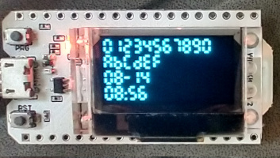

# oled7segment.py

A lightweight 7 segment character generator that allows cutomizable sizing to fit small OLED displays.

### Sample Code

##### Hardware:

##### Set up:

Used with all examples:
```python
import sys
import machine
from machine import Pin, SoftI2C
import ssd1306
import gfx
import utime as time

from oled7segment import *

i2c = SoftI2C(scl=Pin(15), sda=Pin(4))

pin = Pin(16, Pin.OUT)
pin.value(0) #set GPIO16 low to reset OLED
pin.value(1) #while OLED is running, must set GPIO16 in high

oled_width = 128
oled_height = 64
oled = ssd1306.SSD1306_I2C(oled_width, oled_height, i2c)

graphic = gfx.GFX (oled_width, oled_height, oled.pixel)

seven_segment = OLED7Segment (graphic)

d_t = time.localtime ()
date_str = '{:02d}-{:02d}'.format (d_t[1], d_t[2])
time_str = '{:02d}:{:02d}'.format (d_t[3], d_t[4])
```

##### Small segments
```python
xpos = 0
ypos = 0
seven_segment.set_parameters (digit_size="S", spacing=2)
oled.fill (0)
seven_segment.display_string (xpos, ypos, "01234567890")
ypos += seven_segment.get_character_height ()   
seven_segment.display_string (xpos, ypos, "ABCDEF")
ypos += seven_segment.get_character_height ()
seven_segment.display_string (xpos, ypos, date_str)
ypos += seven_segment.get_character_height ()
seven_segment.display_string (xpos, ypos, time_str) One 
ypos += seven_segment.get_character_height ()
oled.show ()
```
 One 
